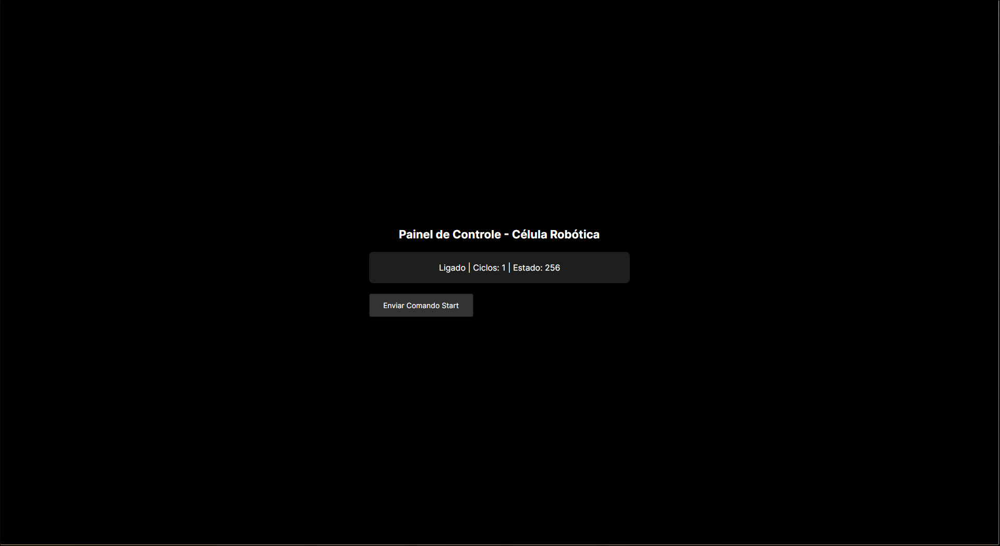
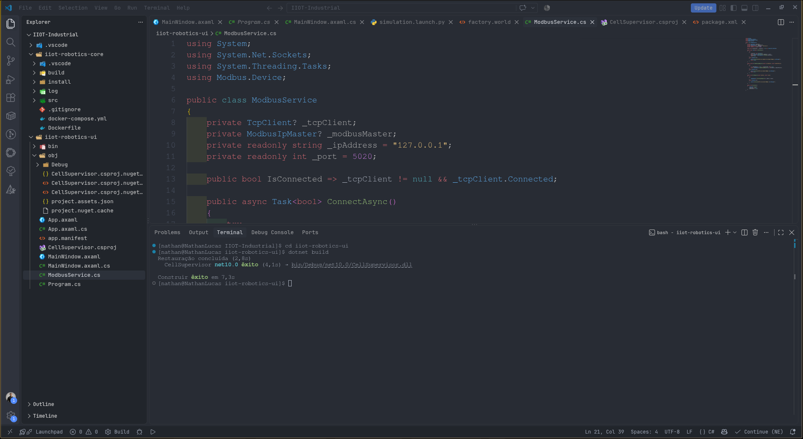
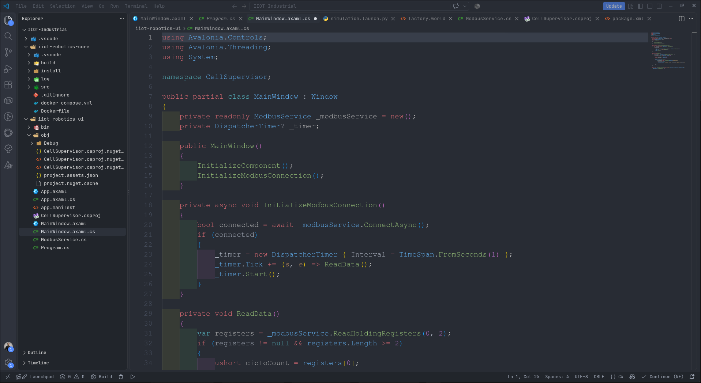

# Sistema Supervisório IIoT — ROS 2 & C# Avalonia UI

Arquitetura de supervisão industrial de ponta a ponta desenvolvida para integrar robótica, simulação em ambiente containerizado e uma interface gráfica (HMI) de alta performance via Modbus TCP.

---

## ⌨️ Visão Geral da Arquitetura

O projeto divide-se em dois grandes blocos que comunicam através de redes industriais:
1. **`iiot-robotics-core` (Backend C++ / ROS 2 / Docker):** Responsável por executar a simulação da célula robótica e servir os dados de telemetria e o estado da máquina através de um servidor Modbus TCP na porta `5020`.
2. **`iiot-robotics-ui` (Supervisório C# / Avalonia UI):** Uma HMI desktop multiplataforma construída em .NET que consome os dados do backend em tempo real e permite enviar comandos operacionais.

---

## ⚡ Demonstração Visual do Sistema

### 1. Interface Gráfica do Supervisório (HMI)
O painel de controlo em Avalonia UI a exibir o estado da célula, contagem de ciclos e o botão de comando Start:


### 2. Camada de Comunicação Modbus TCP (`ModbusService.cs`)
Implementação em C# utilizando `NModbus4` para a gestão do socket TCP e leitura periódica dos registos da célula:


### 3. Gestão de Ciclos e Temporizador (`MainWindow.xaml.cs`)
Lógica do *code-behind* responsável por atualizar a interface periodicamente a cada segundo com os dados obtidos da rede industrial:


---

## ⚙️ Tecnologias Utilizadas
* **C++ & ROS 2 (Humble):** Processamento de robótica e nós de automação.
* **Docker & Docker Compose:** Isolamento e orquestração do ambiente de backend.
* **C# (.NET 10) & Avalonia UI:** Desenvolvimento da interface gráfica moderna e multiplataforma.
* **Protocolo Modbus TCP:** Comunicação industrial standard entre o servidor robótico e o supervisório.
* **NModbus4:** Biblioteca de suporte para requisições TCP em .NET.

---

## ⌨️ Como Executar o Projeto Localmente

### Passo 1: Clonar o repositório
```bash
git clone https://github.com/LucasSilva1717/iiot-industrial-supervisor.git
cd IIOT-Industrial

```

### Passo 2: Iniciar o Backend ROS 2 no Docker
Certifica-te de que tens o Docker a funcionar na tua máquina e sobe o contentor do core industrial com o docker-compose:

```bash
docker-compose up --build

Este comando vai construir a imagem do ROS 2 e iniciar o servidor Modbus TCP na porta 5020, simulando a célula robótica em background.

```

### Passo 3: Executar o Supervisório (C# Avalonia)
Abre um novo terminal, entra na pasta da interface e compila/executa a aplicação .NET:

```bash
cd iiot-robotics-ui
dotnet build
dotnet run
